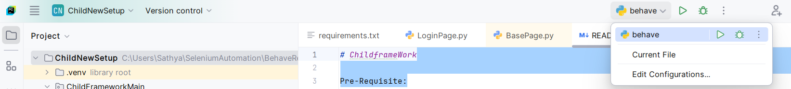
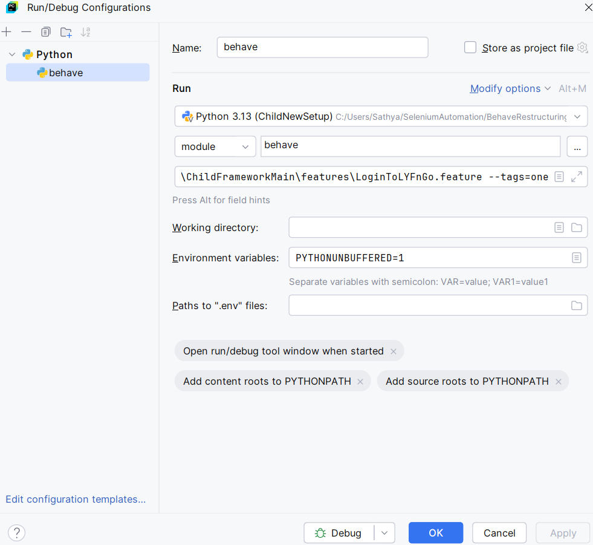
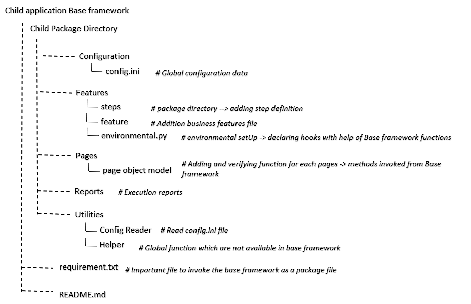

# ChildframeWork

Pre-Requisite:
Installation
    - IDE: Pycharm (Professional if applicable) 
    - Language: Python
    - Packages: behave, selenium, allure-behave
    - Reports to view in HTML:
      - java
      - node.js
      - npm
      - install allure-command line using below in command prompt
        npm install -g allure-commandline
    Add Python\scripts, java, nodejs, allure-command-line, npm in environmental variables

How to Run the test Execution:
    
    Method 1:
    In terminal use the below commands,
    1. behave <subDirectorypackage-name>/features #to run all the scenario in feature path
    2. behave <subDirectorypackage-name>/features --tags=one #to run specific scenario
    
    Method 2:
    1. Add configuration of the feature path to execute
    
    Click Edit Configuration and click ok
    Ref.  
    Now can able to Run or debug on our choice
    
    Method 3:
    To get the report post execution run the below command in the terminal
    behave ChildFrameworkMain/features -f allure_behave.formatter:AllureFormatter -o Reports
    To view the reports in HTML format -> Go the project structure and open command prompt and type
    allure serve Reports -> this will host the local browser and show the graphical report

Loggers:
    Logger file name #LYFnGO-Logger.log is added under sub-directory package to view the log files

Get the base Framework as a package:

    1. Add below text in requirement.txt file 
    git+https://github.com/username/BaseProject.git

    2. From terminal run the below command
    pip install -r requirement.txt

    3. If base project get new update the run the below command in terminal to use new function from Base framework.
    python -m pip uninstall BaseProject
    python -m pip install requirements.txt
    

Framework understanding:
    
    Refer Child framework Structuring. 

    
    